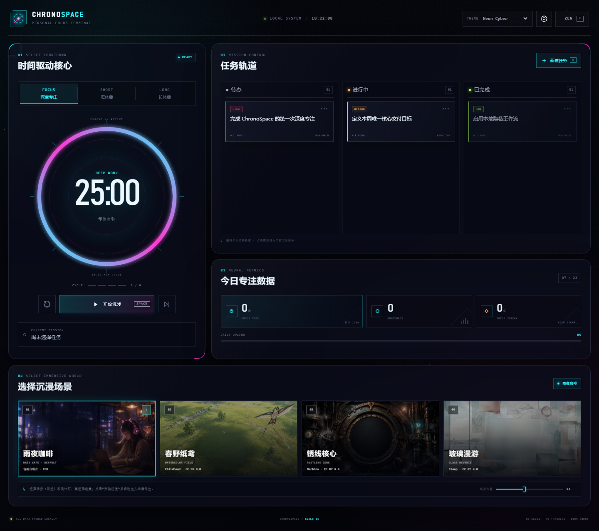

<div align="center">

# ◉ CHRONOSPACE

### PERSONAL FOCUS TERMINAL

**选择任务与倒计时，接入一个会呼吸的沉浸世界。**


</div>

---



---

## 它是什么

ChronoSpace 是一个为开发者、设计师与深度工作者打造的纯前端专注站。它把可靠的番茄计时、三轨任务看板、四个动态沉浸场景和每日专注数据整合进一个高辨识度的界面。

没有账号，没有云端同步，没有遥测。任务、设置和专注记录只存在于你当前的浏览器中。

## 核心能力

- **精确番茄钟**：25 分钟专注、5 分钟短休和 15 分钟长休，支持自定义；以绝对结束时间校准，切换标签页或设备休眠后仍可恢复准确进度。
- **一步进入沉浸**：先选择任务（可跳过）、倒计时与场景，点击“开始沉浸”后自动隐藏控制台，仅保留计时核心和场景控制。
- **四个动态世界**：雨夜咖啡、春野纸鸢、锈线核心与玻璃漫游；原画由 CSS 镜头运动和 Canvas 粒子进行无缝循环增强。
- **场景专属声音**：默认窗雨白噪音，另外三幕配有开放授权音乐；无需联网即可播放，并支持音量与静音控制。
- **三轨任务看板**：待办、进行中、已完成；支持拖拽、优先级、番茄估算、编辑及当前任务绑定。
- **即时完成反馈**：任务归档时触发主题色粒子散落效果。
- **专注数据**：记录今日时长、完成番茄数、每日目标和连续专注天数。
- **四套主题协议**：Neon Cyber、Tokyo Night、Matrix Green、Synthwave Sunset。
- **本地优先**：全部数据写入 LocalStorage，无需服务端，可直接部署到 GitHub Pages。

## 立即运行

这个项目没有构建步骤，也没有第三方运行时依赖。你可以直接双击 `index.html` 使用；脚本采用顺序延迟加载，因此不会触发 `file://` 下的 ES Module 跨域限制。

```bash
git clone <your-repository-url>
cd ChronoSpace
python -m http.server 8080
```

然后访问 `http://localhost:8080`。也可以使用任意静态文件服务器，例如 VS Code Live Server。

> 本地 HTTP 服务更接近 GitHub Pages 的实际部署环境，但不是运行项目的必要条件。

## 快捷键

| 按键 | 操作 |
| --- | --- |
| `Space` | 开始或暂停当前计时 |
| `R` | 重置当前计时 |
| `Z` | 进入或退出沉浸模式 |
| `N` | 创建新任务 |

在表单输入或弹窗打开时，快捷键会自动停用，避免误操作。

## 项目结构

```text
ChronoSpace/
├── index.html              # 语义化页面结构与 SVG 计时光环
├── css/
│   └── style.css           # 设计系统、四套主题与响应式布局
├── js/
│   ├── app.js              # 应用编排、偏好、统计与交互入口
│   ├── timer.js            # 可恢复的番茄计时引擎
│   ├── kanban.js           # 任务模型、拖拽与持久化
│   ├── audio.js            # 场景音轨、淡入与音量状态
│   └── background.js       # 动态场景、粒子背景与完成特效
├── assets/
│   ├── backgrounds/        # 四张沉浸场景原画
│   └── audio/              # 开放授权音轨及署名
├── LICENSE
└── README.md
```

## 数据与隐私

ChronoSpace 不发起业务网络请求，也不包含分析脚本。以下数据保存在浏览器 LocalStorage：

- 任务卡片与当前绑定任务
- 计时器的运行状态和结束时间
- 每日专注时长与番茄完成数
- 主题、计时时长、每日目标和音量偏好

清除站点数据会删除这些记录。若要跨设备迁移数据，可在后续版本中基于本地导入/导出功能扩展，无需引入账号系统。

## 设计与可访问性

- CSS Variables 驱动全部主题色和组件状态
- 桌面端高密度控制台布局，移动端可横向浏览任务轨道
- 语义化标题、表单标签、焦点样式和 ARIA 状态
- 支持 `prefers-reduced-motion`，减少背景与界面动画
- Canvas 的设备像素比设有上限，粒子数量会按视口面积动态控制

## 部署到 GitHub Pages

1. 将项目推送到 GitHub 仓库。
2. 打开仓库的 **Settings → Pages**。
3. 在 **Build and deployment** 中选择 **Deploy from a branch**。
4. 选择默认分支及 `/ (root)` 目录并保存。

项目仅使用相对路径，发布后无需修改资源地址。

## 自定义

主题变量位于 `css/style.css` 顶部。复制任意 `[data-theme="..."]` 变量组即可建立自己的颜色协议。默认时长与偏好位于 `js/app.js` 的 `DEFAULT_PREFERENCES`，声音默认音量位于 `js/audio.js`。

## 音频授权

- 雨夜咖啡：**Rain on Window Loop** by alxl，CC0 1.0
- 春野纸鸢：**Childhood** by Scott Buckley，CC BY 4.0
- 锈线核心：**Machina** by Scott Buckley，CC BY 4.0
- 玻璃漫游：**Sleep** by Scott Buckley，CC BY 4.0

完整来源链接与逐文件许可见 [`assets/audio/LICENSES.md`](assets/audio/LICENSES.md)。这些音频继续适用各自的原始许可，不随项目代码改为 MIT。

## 贡献

欢迎提交 Issue、交互建议和 Pull Request。提交代码前，请重点检查：

- Chrome、Edge、Firefox 的基础交互
- 计时器在后台标签页恢复后的准确性
- 桌面和窄屏布局
- 键盘操作与减少动态效果设置

## License

基于 [MIT License](LICENSE) 开源。你可以自由使用、修改和分发。

---

<div align="center">
  <sub>LOCAL SYSTEM · NO CLOUD · NO TRACKING · 100% YOURS</sub>
</div>
